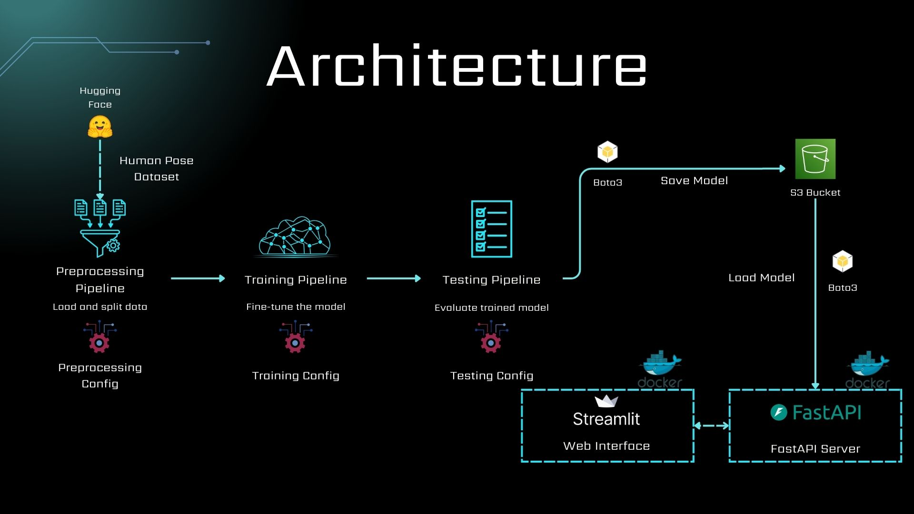
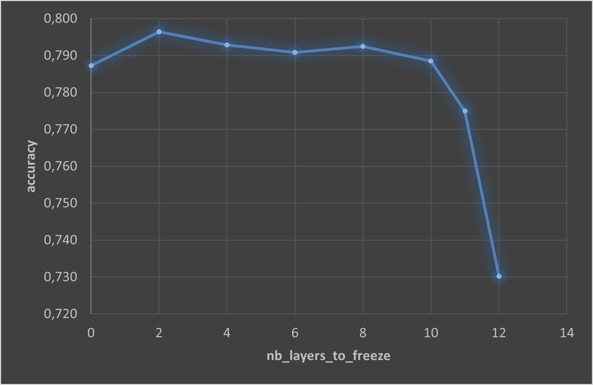
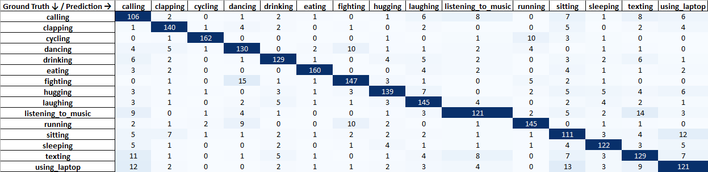

# Human Pose Classifier using Visual Transformers (ViT)

This project implements a **human pose classifier** using Visual Transformers (ViT), covering all required steps from data preprocessing to real-world inference.

The best-performing model achieves high classification metrics:

<div align="center">

| Metric | Value |
| --------- | ------ |
| Accuracy | 0.796 |
| Precision (weighted) | 0.801 |
| Recall (weighted) | 0.796 |
| F1-Score (weighted) | 0.798 |

</div>

The model can be deployed on an **Amazon EC2 Instance**, and a live prototype is accessible via **Streamlit Server**: https://cv-human-pose-classifier-vit-aws-c.streamlit.app/

<div align="center">


</div>

## Key Features & Technologies
- **Data Source**: Human action images are obtained from the [Bingsu/Human_Action_Recognition](https://huggingface.co/datasets/Bingsu/Human_Action_Recognition) dataset, loaded and preprocessed with the **Hugging Face** library.
- **Model Architecture**: A **Vision Transformer (ViT)** fine-tuned to classify images into 15 action categories, such as *calling, clapping, cycling, dancing, drinking, eating, fighting, hugging, laughing, listening_to_music, running, sitting, sleeping, texting, using_laptop*.
- **AWS Integration**: Trained models are automatically uploaded to **S3 Bucket** using **boto3**, enabling easy retrieval during deployment.
- **Deployment**: Model can be served on **EC2 Instance**
- **Web Interface**: Interactive inference via **FastAPI** backend and **Streamlit** frontend.

## Pipelines Overview

### Preprocessing Pipeline ([src/preprocessing_pipeline.py](src/preprocessing_pipeline.py))

The preprocessing stage is designed to be fully configurable through the JSON file [config/preprocessing_config.json](config/preprocessing_config.json). This allows the dataset loading and splitting process to be easily adapted without modifying the code.

| Parameter                  | Type    | Default                               | Description |
|-----------------------------|---------|---------------------------------------|-------------|
| `huggingface_dataset_name` | `str`   | `"Bingsu/Human_Action_Recognition"`   | Name of the dataset on Hugging Face Hub. |
| `test_size`                | `float` | `0.2`                                 | Proportion of the dataset reserved for testing. Must be strictly between 0 and 1. |
| `validation_size`          | `float` | `0.2`                                 | Proportion of the training set reserved for validation. Must be strictly between 0 and 1. |
| `output_dir`               | `str`   | `"data"` | Directory where the processed splits will be saved. |

The main steps of the data preprocessing pipeline are as follows:
1. Download the dataset from Hugging Face using the name specified in the configuration

2. Train/Validation/Test Split:
    - First split: dataset is divided into training and testing sets (`test_size` ratio).

    - Second split: training set is further divided into training and validation subsets (`validation_size` ratio).

    - Ensures that all subsets (train, validation, test) contain the same label classes to avoid imbalance issues.

    > ⚠️ **Note (August 2025):**
    > The official test set of the `Bingsu/Human_Action_Recognition` dataset is currently **erroneous**.
    > It only contains a single class (`"calling"`) but with images from all 15 classes.
    > For this reason, the test set in our pipeline is **re-sampled from the training split** to ensure proper evaluation.

3. Dataset Description: prints a statistical overview of each split (number of samples per class, total size, etc.).

4. Save to Disk: store the three subsets in the specified `output_dir` as `train/`, `val/`, and `test/`.

### Training Pipeline ([src/training_pipeline.py](src/training_pipeline.py))

The training process is fully configurable through the JSON config file [config/training_config.json](config/training_config.json), which is loaded using Pydantic schemas. This allows changing model, training parameters, and output directories without touching the core code.

| Config Section       | Field                           | Type  |Description                                                                 |
|----------------------|---------------------------------|-------|---------------------------------------------------------------------|
| **directories_config** | `input_dir`                    | `str` |Path to load preprocessed `train/` and `val/` datasets                      |
|                      | `clean_train_dir_before_training` | `bool` |Whether to clean checkpoints before training (default: `True`)              |
|                      | `train_dir`                    | `str` |Directory to save training checkpoints                |
|                      | `training_curve_path`          | `str` |Path to save training & validation loss/accuracy curves                     |
|                      | `best_model_path`              | `str` |Path to save the best model after training                                  |
| **model_params**      | `model_name`                   | `str` |Pretrained model name (e.g., `google/vit-base-patch16-224`)                 |
|                      | `nb_layers_to_freeze`          | `int` |Number of ViT encoder layers to freeze (0–12) (default: `None`, i.e., train all encoder layers)                                |
| **training_config** | `enable_gpu`                 | `bool` |Enable GPU training if available  (default: `False`)                                          |
|                      | `learning_rate`                | `float` |Learning rate for the optimizer                          |
|                      | `batch_size`                   | `int` |Training and validation batch size                                          |
|                      | `num_train_epochs`             | `int` |Number of training epochs                                                 |

The main steps of the train pipeline are as follows:
1. **Load Preprocessed Data**
   - Train and validation datasets are loaded from the specified `input_dir`.
   - Checks that both sets contain the same label classes.
   - Creates a mapping `label2id` and `id2label` for consistent training and evaluation.

2. **Model Building**
   - Loads the pretrained model (`ViT`) from Hugging Face.
   - Optionally freezes the first `nb_layers_to_freeze` encoder layers.
   - Initializes image preprocessing transforms (`RandomResizedCrop`, `ToTensor`, `Normalize`).
   - Selects device (`CPU` or `GPU`).

3. **Apply Transforms**
   - Register the transformation steps in both train and validation sets (applied on-the-fly during training).

4. **Training Arguments Setup**
   - Configures `TrainingArguments` (optimizer, logging, evaluation & save strategy).
   - Sets metric for best model selection (`accuracy`).

5. **Training Loop**
   - Cleans previous checkpoints if `clean_train_dir_before_training=True`.
   - Trains the model with Hugging Face `Trainer`.

6. **Metrics & Curves**
   - Tracks train loss, validation loss, and validation accuracy.
   - Plots training/validation curves and saves them to `training_curve_path`.

7. **Save the pipeline**
   - Saves the **best model** to `best_model_path`.
   - Saves preprocessing transforms (`transforms.pkl`) for later inference and testing.

### Testing Pipeline ([src/testing_pipeline.py](src/testing_pipeline.py))

The testing process is fully configurable through the JSON config file [config/testing_config.json](config/testing_config.json), which is loaded using Pydantic schemas. This allows changing model pushing conditions without modifying the core code.

| Parameter                              | Type | Description                                                                                     |
|----------------------------------------|------|------------------------------------------------------------------------------------------|
| `input_dir`                       | `str` |Path to load the preprocessed test dataset                                                      |
| `trained_model_path`                   | `str` |Path to the trained model to be loaded for testing                                             |                                    |
| `metrics_output_file`                  | `str` |File path to save evaluation results (Excel)            |
| `push_model_s3.enabled`                | `bool` |If `true`, allows pushing the model to an S3 bucket if defined conditions are met              |
| `push_model_s3.conditions`             | `list` |List of metric-based conditions that must be satisfied to trigger a model push                 |
| `push_model_s3.conditions.metric`    | `str` |Name of the metric to check (e.g., `accuracy`, `precision`)                                    |
| `push_model_s3.conditions.threshold` | `float` |Minimum required value for the metric to allow model upload to S3 Bucket                             |
| `push_model_s3.bucket_name`            | `str` |Name of the S3 bucket where the model will be uploaded                                         |
| `push_model_s3.prefix`                 | `str` |Folder or path prefix in the bucket under which the model will be stored                      |

The main steps of the testing pipeline are as follows:
1. **Load Test Data**: loads the preprocessed test dataset from the specified `input_dir`.

2. **Load Model and Transforms**
   - Loads the trained ViT model from `trained_model_path`.
   - Loads the preprocessing transforms (`transforms.pkl`) saved during training.

3. **Predictions**
   - Calculates predictions on the entire test dataset.
   - Collects both predicted and ground truth labels.

4. **Metrics & Reporting**
   - Computes global metrics (accuracy, precision, recall, F1-score).
   - Generates confusion matrix and per-class accuracy.
   - Saves all results into the Excel file defined by `metrics_output_file`. An example output file can be found in [data/output](data/output) folder.

5. **Model Push to S3 (Optional)**
   - If enabled, checks whether the evaluation metrics meet the configured thresholds.
   - If all conditions are satisfied, uploads the model directory to the specified S3 bucket.

## Inference using FastAPI / Streamlit Application

<div style="text-align: center;">
    
</div>

## Experiments and Performance Analysis

### 1. Impact of Freezing Layers (Fine-Tuning Strategy)

To identify the best-performing model, the impact of the number of frozen layers during fine-tuning was analyzed.
As shown in the performance curve, the highest accuracy is obtained when freezing **2 layers**, while keeping the rest of the network trainable. This configuration provides a good trade-off between preserving pretrained features and adapting to the target dataset.

<div style="text-align: center;">
    
</div>

The observed trend shows that freezing too many layers leads to a drop in performance and this is mainly due to the limited adaptability of the model to the target data. Freezing fewer layers increases the model’s capacity to fit the dataset.
However, it also leads to longer training time and a higher risk of overfitting (see train/validation curves in [figs](figs) folder), since the network can more easily memorize dataset-specific patterns instead of learning generalizable features.

### 2. Performance Analysis (Test Set)

The confusion matrix ([data/output/performance_metrics_15_2.xlsx](data/output/performance_metrics_15_2.xlsx)) reveals that most classes are correctly classified, but several activities are frequently confused due to visual similarity and overlapping contexts.

In particular, **calling**, **texting**, **using laptop**, and **listening to music** show mutual confusion. These actions often involve similar postures (e.g., holding a phone, sitting, minimal body motion), which makes them harder to distinguish visually. Similar confusion is also observed between **running** and **cycling**, as both involve fast motion and similar body dynamics in outdoor scenes. Likewise, **dancing** and **fighting** are occasionally confused, likely due to similar arm movements and high-energy gestures.
To test this behavior, feel free to use the following demo: https://cv-human-pose-classifier-vit-aws-c.streamlit.app/

Overall, the lowest-performing classes in terms of accuracy are:
- **using_laptop** (69.9%)
- **calling** (71.1%)
- **sitting** (71.6%)
- **texting** (72.5%)
- **listening_to_music** (72.9%)

These classes correspond to activities with subtle visual differences, highlighting the difficulty of fine-grained action recognition when motions are small or visually ambiguous.

<div style="text-align: center;">
    
</div>

## AWS Services Configuration for Model Deployment
1. Create a User using **AWS IAM Service** with the following permissions:
    - `AmazonEC2FullAccess`
    - `AmazonS3FullAccess`

    *(You can also create a custom policy for more restricted access if needed.)*

2. **Generate an Access Key** for this IAM user and **save the following securely**:
    - Access Key ID
    - Secret Access Key

3. The S3 Bucket will be created dynamically during the execution of the [testing_pipeline.py](src/testing_pipeline.py). If the best found model during training achieves the required score in the [testing_config.json](config/testing_config.json), it will be uploaded to this bucket.\
⚠️ (*Make sure the bucket name you configure is globally unique to avoid conflicts.*)

4. Create an EC2 instance with the following specifications:
    - **AMI**: Deep Learning OSS Nvidia Driver AMI GPU PyTorch 2.7 (Ubuntu 22.04)
    - **Instance type**: `t3.medium`
    - **Key Pair**: Use the key pair you downloaded to connect via SSH
    - **Security Group**:
        - Allow inbound rules for ports: `22`, `80`, `8501`, `8502` (all TCP)
    - **Storage**: 120 GiB (gp3)

5. Run the EC2 instance and interact with it via SSH or any other remote access method to set up the environment:
    - Create a working directory:
        ```bash
        mkdir mlops
        cd mlops
        ```
    - Clone the GitHub repo:
        ```bash
        git clone https://github.com/Lahdhirim/CV-human-pose-classifier-ViT-aws.git
        cd CV-human-pose-classifier-ViT-aws
        ```
    - Install dependencies:
        ```bash
        pip install -r requirements.txt
        ```
    - Configure the AWS credentials using AWS CLI:
        ```bash
        aws configure Press ENTER
        AWS Access Key ID: ************
        AWS Secret Access Key: ************
        Default region name: Press ENTER
        Default output format: Press ENTER
        ```
    - Add Streamlit to PATH (for command-line use):
        ```bash
        echo 'export PATH="$HOME/.local/bin:$PATH"' >> ~/.bashrc
        source ~/.bashrc
        ```

6. (Optional but recommended) Run the application from the terminal to ensure that everything is working correctly:
    ```bash
    python3 src/web_app/server.py
    ```
    in a new terminal:
    ```bash
    streamlit run src/web_app/interface.py
    ```
    Normally, at this stage, if everything works fine, the application is accessible at `http://<public IPv4 address>:8501`

7. Automatically launch Streamlit on instance reboot:
    - Create the startup script:
      ```bash
      nano /home/ubuntu/start_streamlit.sh
      ```

      Paste the following:
      ```bash
        #!/bin/bash
        cd /home/ubuntu/mlops/CV-human-pose-classifier-ViT-aws
        source /home/ubuntu/.bashrc
        nohup /usr/bin/python3 src/web_app/server.py >> /home/ubuntu/fastapi.log 2>&1 &
        sleep 20
        nohup /home/ubuntu/.local/bin/streamlit run src/web_app/interface.py --server.port 8501 >> /home/ubuntu/streamlit.log 2>&1 &
      ```

    - Make the script executable:
        ```bash
        chmod +x /home/ubuntu/start_streamlit.sh
        ```
    - Add the script to `crontab` for reboot:
        ```bash
        crontab -e
        ```
        Add the following line at the end of the file:
        ```bash
        @reboot /home/ubuntu/start_streamlit.sh
        ```

Each time the instance is rebooted, Streamlit will automatically launch the web application at the address  `http://<public IPv4 address>:8501`. Two log files named  `fastapi.log` and `streamlit.log` will be created in the  `/home/ubuntu` directory. These files can be used to monitor the application’s status and debug any errors.\
The application will be publicly accessible to anyone with the instance’s public IP address. Access can be controlled via the EC2 Security Group:
- To allow access from any IP address, set the Source  `to 0.0.0.0/0` on TCP port  `8501`.\
    ⚠️ Use  `0.0.0.0/0` only if you're aware of the security implications. For more restricted access, specify your own IP or a limited range.

## Alternative Model Deployment (Docker-Based)
After training phase, the model can be deployed easily using Docker which removes the need for manual environment setup and complex startup scripts. This is the recommended deployment method for both local and cloud environments:
1. Clone the GitHub repo:

    ```bash
    git clone https://github.com/Lahdhirim/CV-human-pose-classifier-ViT-aws.git
    cd CV-human-pose-classifier-ViT-aws
    ```
2. Configure AWS Credentials (Required to download the trained model from S3)
    1. Install [AWS CLI](https://docs.aws.amazon.com/cli/latest/userguide/getting-started-install.html)
    2. Configure your credentials using `aws configure`
    3. Verify the configuration using `cat ~/.aws/credentials`
3. Build and run the containers:

    ```bash
    docker compose up --build -d
    ```

4. Access the application:
    - Streamlit UI:
    `http://<PUBLIC_IP>:8501`
    - FastAPI docs:
    `http://<PUBLIC_IP>:8502/docs`


## Running the Pipelines

There are four main execution modes, recommended in the following order:

### Preprocess the Data (mandatory to collect the data)
```bash
python main.py preprocess_data
```

### Run the Training Pipeline (mandatory to find the best model)
```bash
python main.py train
```

### Run the Testing Pipeline (mandatory to push the best model to S3 Bucket)
```bash
python main.py test
```

### Run the Web Application
```bash
python main.py inference
```

## Human Pose Classification & Beyond

This classifier is designed not only for human action recognition but also as a **flexible image classification framework**. Thanks to its modular pipeline and configuration-driven design:

- **Configurable Pipelines**: Each stage of the workflow (preprocessing, training, testing and inference) is controlled by its own configuration file (`preprocessing_config.json`, `training_config.json`, `testing_config.json`, `inference_config.json`).
- **No Code Changes Required**: You can adapt the application to new datasets or classification tasks simply by updating the configuration files.
- **End-to-End Workflow**: From data preprocessing to model training, evaluation, and deployment, all steps are fully automated and modular.
- **Rapid Deployment**: The same FastAPI + Streamlit interface can serve any trained model without modification, making it suitable for a wide range of computer vision tasks.
